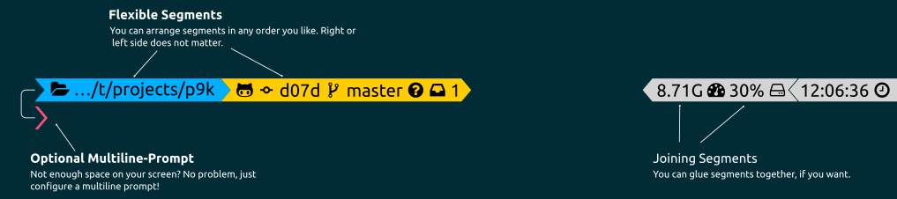

---
[](https://travis-ci.org/bhilburn/powerlevel9k)
[](https://gitter.im/bhilburn/powerlevel9k?utm_source=badge&utm_medium=badge&utm_campaign=pr-badge&utm_content=badge)

Powerlevel9k is a theme for ZSH which uses [Powerline
Fonts](https://github.com/powerline/fonts). It can be used with vanilla ZSH or
ZSH frameworks such as [Oh-My-Zsh](https://github.com/robbyrussell/oh-my-zsh),
[Prezto](https://github.com/sorin-ionescu/prezto),
[Antigen](https://github.com/zsh-users/antigen), and [many
others](INSTALL.md).

Get more out of your terminal. Be a badass. Impress everyone in 'Screenshot Your
Desktop' threads. Use powerlevel9k.



You can check out some other users' configurations in our wiki: [Show Off Your
Config](https://github.com/bhilburn/powerlevel9k/wiki/Show-Off-Your-Config).

There are a number of Powerline ZSH themes available, now. The developers of
this theme focus on four primary goals:

1. Give users a great out-of-the-box configuration with no additional
   configuration required.
2. Make customization easy for users who do want to tweak their prompt.
3. Provide useful segments that you can enable to make your prompt even more
   effective and helpful. We have prompt segments for everything from unit test
   coverage to your AWS instance.
4. Optimize the code for execution speed as much as possible. A snappy terminal
   is a happy terminal.

Powerlevel9k can be used to create both very useful and beautiful terminal environments:


### Table of Contents

1. [Installation](#installation)
2. [Customization](#prompt-customization)
    1. [Stylizing Your Prompt](https://github.com/bhilburn/powerlevel9k/wiki/Stylizing-Your-Prompt)
    2. [Customizing Prompt Segments](#customizing-prompt-segments)
    3. [Available Prompt Segments](#available-prompt-segments)
3. [Troubleshooting](https://github.com/bhilburn/powerlevel9k/wiki/Troubleshooting)

Be sure to also [check out the Wiki](https://github.com/bhilburn/powerlevel9k/wiki)!

### Installation
There are two installation steps to go from a vanilla terminal to a PL9k
terminal. Once you are done, you can optionally customize your prompt.

[Installation Instructions](INSTALL.md)

1. [Install the Powerlevel9k Theme](INSTALL.md#step-1-install-powerlevel9k)
2. [Install Powerline Fonts](INSTALL.md#step-2-install-a-powerline-font)

No configuration is necessary post-installation if you like the default
settings, but there are plenty of segment customization options available if you
are interested.

### Prompt Customization

Be sure to check out the wiki page on the additional prompt customization
options, including color and icon settings: [Stylizing Your Prompt](https://github.com/bhilburn/powerlevel9k/wiki/Stylizing-Your-Prompt)

#### Customizing Prompt Segments
Customizing your prompt is easy! Select the segments you want to have displayed,
and then assign them to either the left or right prompt by adding the following
variables to your `~/.zshrc`.

| Variable | Default Value | Description |
|----------|---------------|-------------|
|`P9K_LEFT_PROMPT_ELEMENTS`|`(context dir vcs)`|Segment list for left prompt|
|`P9K_RIGHT_PROMPT_ELEMENTS`|`(status root_indicator background_jobs history time)`|Segment list for right prompt|


The table above shows the default values, so if you wanted to set these
variables manually, you would put the following in
your `~/.zshrc`:
```zsh
P9K_LEFT_PROMPT_ELEMENTS=(context dir vcs)
P9K_RIGHT_PROMPT_ELEMENTS=(status root_indicator background_jobs history time)
```

#### Tagging segments

It is possible to mark segments to add some functionality. This process is called
`tagging`. The tags are simple strings appended to the segment name in your
`P9K_LEFT_PROMPT_ELEMENTS` or `P9K_RIGHT_PROMPT_ELEMENTS`. So, if you want to tag
a `dir` segment, just append the tags, separated by double colons to the segments
name. `dir` becomes `dir::tag1::tag2`. The order of tags does not matter.

| Tag      | Description |
|----------|--------------
| `joined` | This causes the current segment to be joined with the previous one. So no segment separator will be printed between the two segments. |
| `custom` | Use this tag, if you want to add the output of an arbitrary command as [Custom Segment](#custom_segments). |

Caveat: All double colons will be interpreted as tags, so if your original segment
name contains `::`, that would probably not work.

#### Available Prompt Segments
The segments that are currently available are:

**System Status Segments:**
* [`background_jobs`](segments/background_jobs/README.md) - Indicator for background jobs.
* [`battery`](segments/battery/README.md) - Current battery status.
* [`context`](segments/context/README.md) - Your username and host, conditionalized based on $USER and SSH status.
* [`date`](segments/date/README.md) - System date.
* [`dir`](segments/dir/README.md) - Your current working directory.
* [`dir_writable`](segments/dir_writable/README.md) - Displays a lock icon, if you do not have write permissions on the current folder.
* [`disk_usage`](segments/disk_usage/README.md) - Disk usage of your current partition.
* [`history`](segments/history/README.md) - The command number for the current line.
* [`host`](segments/host/README.md) - Your current host name
* [`ip`](segments/ip/README.md) - Shows the current IP address.
* [`vpn_ip`](segments/vpn_ip/README.md) - Shows the current VPN IP address.
* [`public_ip`](segments/public_ip/README.md) - Shows your public IP address.
* [`load`](segments/load/README.md) - Your machine's load averages.
* [`os_icon`](segments/os_icon/README.md) - Display a nice little icon, depending on your operating system.
* [`ram`](segments/ram/README.md) - Show free RAM.
* [`root_indicator`](segments/root_indicator/README.md) - An indicator if the user has superuser status.
* [`status`](segments/status/README.md) - The return code of the previous command.
* [`swap`](segments/swap/README.md) - Prints the current swap size.
* [`time`](segments/time/README.md) - System time.
* [`user`](segments/user/README.md) - Your current username
* [`vi_mode`](segments/vi_mode/README.md)- Your prompt's Vi editing mode (NORMAL|INSERT).
* [`ssh`](segments/ssh/README.md) - Indicates whether or not you are in an SSH session.

**Development Environment Segments:**
* [`gitstatus`](segments/gitstatus/README.md) - Information about this `git` repository (if you are in one).
* [`vcs`](segments/vcs/README.md) - Information about this `git` or `hg` repository (if you are in one).

**Language Segments:**
* **GoLang Segments:**
    * [`go_version`](segments/go_version/README.md) - Show the current GO version.
* **Javascript / Node.js Segments:**
    * [`node_version`](segments/node_version/README.md) - Show the version number of the installed Node.js.
    * [`nodeenv`](segments/nodeenv/README.md) - [nodeenv](https://github.com/ekalinin/nodeenv) prompt for displaying node version and environment name.
    * [`nvm`](segments/nvm/README.md) - Show the version of Node that is currently active, if it differs from the version used by NVM
* **PHP Segments:**
    * [`php_version`](segments/php_version/README.md) - Show the current PHP version.
    * [`laravel_version`](segments/laravel_version/README.md) - Show the current Laravel version.
    * [`symfony2_tests`](segments/symfony2_tests/README.md) - Show a ratio of test classes vs code classes for Symfony2.
    * [`symfony2_version`](segments/symfony2_version/README.md) - Show the current Symfony2 version, if you are in a Symfony2-Project dir.
* **Python Segments:**
    * [`virtualenv`](segments/virtualenv/README.md) - Your Python [VirtualEnv](https://virtualenv.pypa.io/en/latest/).
    * [`anaconda`](segments/anaconda/README.md) - Your active [Anaconda](https://www.continuum.io/why-anaconda) environment.
    * [`pyenv`](segments/pyenv/README.md) - Your active python version as reported by the first word of [`pyenv version`](https://github.com/yyuu/pyenv). Note that the segment is not displayed if that word is _system_ i.e. the segment is inactive if you are using system python.
* **Ruby Segments:**
    * [`chruby`](segments/chruby/README.md) - Ruby environment information using `chruby` (if one is active).
    * [`rbenv`](segments/rbenv/README.md) - Ruby environment information using `rbenv` (if one is active).
    * [`rspec_stats`](segments/rspec_stats/README.md) - Show a ratio of test classes vs code classes for RSpec.
    * [`rvm`](segments/rvm/README.md) - Ruby environment information using `$GEM_HOME` and `$MY_RUBY_HOME` (if one is active).
* **Rust Segments:**
    * [`rust_version`](segments/rust_version/README.md) - Display the current rust version and [logo](https://www.rust-lang.org/logos/rust-logo-blk.svg).
* **Swift Segments:**
    * [`swift_version`](segments/swift_version/README.md) - Show the version number of the installed Swift.
* **Java Segments:**
    * [`java_version`](segments/java_version/README.md) - Show the current Java version.
* **Haskell Segments:**
    * [`stack_project`](segments/stack_project/README.md) - Show if you are in a Haskell Stack project directory.

**Cloud Segments:**
* **AWS Segments:**
    * [`aws`](segments/aws/README.md) - The current AWS profile, if active.
    * [`aws_eb_env`](segments/aws_eb_env/README.md) - The current Elastic Beanstalk Environment.
* [`docker_machine`](segments/docker_machine/README.md) - The current Docker Machine.
* [`kubecontext`](segments/kubecontext/README.md) - The current context of your `kubectl` configuration.
* [`dropbox`](segments/dropbox/README.md) - Indicates Dropbox directory and syncing status using `dropbox-cli`

**Other:**
* [Custom Segment](#custom_segments) - Create a custom segment to display the
  output of an arbitrary command.
* [`command_execution_time`](segments/command_execution_time/README.md) - Display the time the current command took to execute.
* [`todo`](segments/todo/README.md) - Shows the number of tasks in your [todo.txt](http://todotxt.com/) tasks file.
* [`detect_virt`](segments/detect_virt/README.md) - Virtualization detection with systemd
* [`newline`](segments/newline/README.md) - Continues the prompt on a new line.
* [`openfoam`](segments/openfoam/README.md) - Shows the currently sourced [OpenFOAM](https://openfoam.org/) environment.
* [`vagrant`](segments/vagrant/README.md) - Detects if you are in a folder with a running VM.

--------------------------------------------------------------------------------

##### Custom Segments

Segments tagged as `::custom` allows you to turn the output of a custom command into
a prompt segment. As an example, if you wanted to create a custom segment to
display your WiFi signal strength, you might define a custom segment called
`wifi_signal::custom` like this:
```zsh
P9K_LEFT_PROMPT_ELEMENTS=(context time battery dir vcs virtualenv custom_wifi_signal)
P9K_CUSTOM_WIFI_SIGNAL="echo signal: \$(nmcli device wifi | grep yes | awk '{print \$8}')"
P9K_CUSTOM_WIFI_SIGNAL_BACKGROUND="blue"
P9K_CUSTOM_WIFI_SIGNAL_FOREGROUND="yellow"
```
If you prefer, you can also define the function in your `.zshrc` rather than
putting it in-line with the variable export, as shown above. Just don't forget
to invoke your function from your segment! Example code that achieves the same
result as the above:
```zsh
zsh_wifi_signal(){
    local signal=$(nmcli device wifi | grep yes | awk '{print $8}')
    local color='%F{yellow}'
    [[ $signal -gt 75 ]] && color='%F{green}'
    [[ $signal -lt 50 ]] && color='%F{red}'
    echo -n "%{$color%}\uf230  $signal%" # \uf230 is 
}

P9K_CUSTOM_WIFI_SIGNAL="zsh_wifi_signal"
P9K_LEFT_PROMPT_ELEMENTS=(context time battery dir vcs virtualenv wifi_signal::custom)
```
The command, above, gives you the wireless signal segment shown below:


You can define as many custom segments as you wish. If you think you have
a segment that others would find useful, please consider upstreaming it to the
main theme distribution so that everyone can use it!

### Disabling / Enabling Powerlevel9k

You can disable P9k and return to a very basic prompt at any time simply by
calling:

```zsh
$ prompt_powerlevel9k_teardown
```

You can then re-enable it by calling:

```zsh
$ prompt_powerlevel9k_setup
```

### tl; dr

Want to just get a quick start? Check out the [Show Off Your
Config](https://github.com/bhilburn/powerlevel9k/wiki/Show-Off-Your-Config)
portion of the wiki to get going.

[The Wiki also has a ton of other useful
information!](https://github.com/bhilburn/powerlevel9k/wiki)

### License

Project: MIT

Logo: CC-BY-SA. Source repository: https://github.com/bhilburn/powerlevel9k-logo
