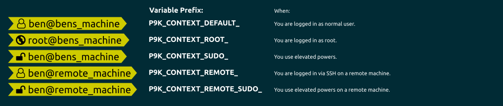

# Context


## Installation

To use this segment, you need to activate it by adding `context` to your
`P9K_LEFT_PROMPT_ELEMENTS` or `P9K_RIGHT_PROMPT_ELEMENTS` array, depending
where you want to show this segment.

## States

This segment can have different states. You can customize the different states
as you wish. Here is a quick overview:



## Configuration

The `context` segment (user@host string) is conditional. By default, it will
only print if you are not your 'normal' user (including if you are root), or if
you are SSH'd to a remote host. `SUDO` and `REMOTE_SUDO` states are also available to show whether the current user or remote user has superuser privileges.

To use this feature, make sure the `context` segment is enabled in your prompt
elements (it is by default), and define a `DEFAULT_USER` in your `~/.zshrc`.

You can customize the `context` segment. For example, you can make it to print the
full hostname by setting

```
P9K_CONTEXT_TEMPLATE="%n@`hostname -f`"
```

You can set the `P9K_CONTEXT_HOST_DEPTH` variable to change how the
hostname is displayed. See [ZSH Manual](http://zsh.sourceforge.net/Doc/Release/Prompt-Expansion.html#Login-information)
for details. The default is set to %m which will show the hostname up to the first ‘.’
You can set it to %{N}m where N is an integer to show that many segments of system
hostname. Setting N to a negative integer will show that many segments from the
end of the hostname.

| Variable | Default Value | Description |
|----------|---------------|-------------|
|`DEFAULT_USER`|None|Username to consider a "default context".|
|`P9K_CONTEXT_ALWAYS_SHOW`|false|Always show this segment, including `$USER` and hostname.|
|`P9K_CONTEXT_ALWAYS_SHOW_USER`|false|Always show the username, but conditionalize the hostname.|
|`P9K_CONTEXT_TEMPLATE`|%n@%m|Default context prompt (username@machine). Refer to the [ZSH Documentation](http://zsh.sourceforge.net/Doc/Release/Prompt-Expansion.html) for all possible expansions, including deeper host depths.|
|`P9K_CONTEXT_TEMPLATE_DEFAULT_USER`|$P9K_CONTEXT_TEMPLATE|Default context prompt when current username is `$DEFAULT_USER`.|

This segment can have different states. They might help you to visualize your
different privileges.

| State         | Meaning                                                  |
|---------------|----------------------------------------------------------|
| `DEFAULT`     | You are a normal user                                    |
| `ROOT`        | You are the root user                                    |
| `SUDO`        | You are using elevated rights                            |
| `REMOTE_SUDO` | You are SSH'ed into the machine and have elevated rights |
| `REMOTE`      | You are SSH'ed into the machine                          |

### Color Customization

You can change the foreground and background color of this segment by setting
```
# Default User
P9K_CONTEXT_DEFAULT_FOREGROUND='red'
P9K_CONTEXT_DEFAULT_BACKGROUND='blue'

# Root User
P9K_CONTEXT_ROOT_FOREGROUND='red'
P9K_CONTEXT_ROOT_BACKGROUND='blue'

# Sudo User
P9K_CONTEXT_SUDO_FOREGROUND='red'
P9K_CONTEXT_SUDO_BACKGROUND='blue'

# Remote User
P9K_CONTEXT_REMOTE_FOREGROUND='red'
P9K_CONTEXT_REMOTE_BACKGROUND='blue'

# Remote Sudo User
P9K_CONTEXT_REMOTE_SUDO_FOREGROUND='red'
P9K_CONTEXT_REMOTE_SUDO_BACKGROUND='blue'
```

### Customize Icon

The main Icon of this segment depends on its state.
It can be changed by setting:
```
P9K_CONTEXT_DEFAULT_ICON="my_icon"
P9K_CONTEXT_ROOT_ICON="my_icon"
P9K_CONTEXT_REMOTE_ICON="my_icon"
P9K_CONTEXT_REMOTE_SUDO_ICON="my_icon"
```

The Icon color accordingly:
```
P9K_CONTEXT_DEFAULT_ICON_COLOR="red"
P9K_CONTEXT_ROOT_ICON_COLOR="red"
P9K_CONTEXT_REMOTE_ICON_COLOR="red"
P9K_CONTEXT_REMOTE_SUDO_ICON_COLOR="red"
```
