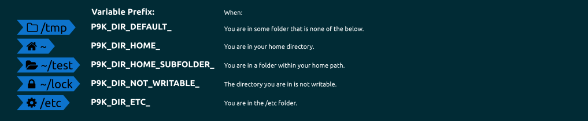
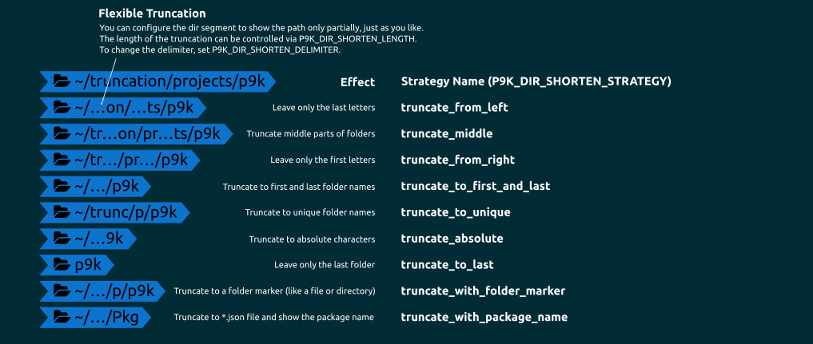

# Dir


## Installation

To use this segment, you need to activate it by adding `dir` to your
`P9K_LEFT_PROMPT_ELEMENTS` or `P9K_RIGHT_PROMPT_ELEMENTS` array, depending
where you want to show this segment.

## States

This segment can have different states. You can customize the different states
as you wish. Here is a quick overview:



## Configuration

The `dir` segment shows the current working directory. When using the "Awesome
Powerline" fonts, there are additional glyphs, as well:

| `Compatible` | `Powerline` | `Awesome Powerline` | Situation
|------------|-----------|-------------------|----------------------------
| None       | None      |  | At the root of your home folder |
| None       | None      |  | Within a subfolder of your home directory |
| None       | None      |  | Outside of your home folder |
| None       | None      | ⚙ | Within the `/etc` directory |

To turn off these icons you could set these variables to an empty string.
```zsh
P9K_DIR_HOME_ICON=''
P9K_DIR_HOME_SUBFOLDER_ICON=''
P9K_FOLDER_ICON=''
P9K_DIR_ETC_ICON=''
```

### Truncation

You can limit the output to a certain length by truncating long paths.
Customizations available are:

| Variable | Default Value | Description |
|----------|---------------|-------------|
|`P9K_DIR_PATH_ABSOLUTE`|None|If set to `true`, will use absolute paths instead of home folder abbreviation `~`|
|`P9K_DIR_SHORTEN_LENGTH`|`2`|If your shorten strategy, below, is entire directories, this field determines how many directories to leave at the end. If your shorten strategy is by character count, this field determines how many characters to allow per directory string.|
|`P9K_DIR_SHORTEN_STRATEGY`|None|How the directory strings should be truncated. See the table below for more informations.|
|`P9K_DIR_SHORTEN_DELIMITER`|`…`|Delimiter to use in truncated strings. This can be any string you choose, including an empty string if you wish to have no delimiter.|



| Strategy Name | Description |
|---------------|-------------|
|Default|Truncate whole directories from left. How many is defined by `P9K_DIR_SHORTEN_LENGTH`|
|`truncate_absolute`|Truncates everything except the last few characters in the path. E.g. if you are in a folder named `~/Projects/powerlevel9k` and you have set `P9K_DIR_SHORTEN_LENGTH=3` and `P9K_DIR_SHORTEN_DELIMITER=".."`, you will get `..l9k`.|
|`truncate_middle`|Truncates the middle part of a folder. E.g. you are in a folder named `~/MySuperProjects/AwesomeFiles/BoringOffice`, then it will truncated to `~/MyS..cts/Awe..les/BoringOffice`, if `P9K_DIR_SHORTEN_LENGTH=3` is also set (controls the amount of characters to be left).|
|`truncate_from_right`|Just leaves the beginning of a folder name untouched. E.g. your folders will be truncated like so: `/ro../Pr../office`. How many characters will be untouched is controlled by `P9K_DIR_SHORTEN_LENGTH`.|
|`truncate_to_last`|Truncates everything before the last folder in the path.|
|`truncate_to_first_and_last`|Truncate middle directories from the path. How many directories will be untouched is controlled by `P9K_DIR_SHORTEN_LENGTH`. E.g. if you are in a folder named `~/Projects/powerlevel9k` and you have set `P9K_DIR_SHORTEN_LENGTH=1`, you will get `~/../powerlevel9k`.||
|`truncate_to_unique`|Parse all parent path components and truncate them to the shortest unique length. If you copy & paste the result to a shell, after hitting `TAB` it should expand to the original path unambiguously.|
|`truncate_with_package_name`|Search for a `package.json` or `composer.json` and prints the `name` field to abbreviate the directory path. The precedence and/or files could be set by `P9K_DIR_PACKAGE_FILES=(package.json composer.json)`. If you have [jq](https://stedolan.github.io/jq/) installed, it will dramatically improve the speed of this strategy. Can optionally fallback to git if `P9K_DIR_SHORTEN_GIT_FALLBACK` is non-zero, taking name from remote `P9K_DIR_SHORTEN_GIT_REMOTE_NAME` or 'origin' if `P9K_DIR_SHORTEN_GIT_USE_REMOTE` is non-zero, otherwise or if remote not available use local folder name |
|`truncate_with_folder_marker`|Search for a file that is specified by `P9K_DIR_SHORTEN_FOLDER_MARKER` and truncate everything before that (if found, otherwise stop on $HOME and ROOT).|

For example, if you wanted the truncation behavior of the `fish` shell, which
truncates `/usr/share/plasma` to `/u/s/plasma`, you would use the following:
```zsh
P9K_DIR_SHORTEN_LENGTH=1
P9K_DIR_SHORTEN_DELIMITER=""
P9K_DIR_SHORTEN_STRATEGY="truncate_from_right"
```
In each case you have to specify the length you want to shorten the directory
to. So in some cases `P9K_DIR_SHORTEN_LENGTH` means characters, in
others whole directories.

The `truncate_with_package_name` strategy gives your directory path relative to the root of your project.  For example, if you have a project inside `$HOME/projects/my-project` with a `package.json` that looks like:

```json
{
  "name": "my-cool-project"
}
```

The path shown would be `my-cool-project`.  If you navigate to `$HOME/projects/my-project/src`, then the path shown would be `my-cool-project/src`.  Please note that this currently looks for `.git` directory to determine the root of the project.

If you want to customize the directory separator, you could set:
```zsh
# Double quotes are important here!
P9K_DIR_PATH_SEPARATOR="%F{red} $(print_icon 'LEFT_SUBSEGMENT_SEPARATOR') %F{black}"
```
To omit the first character (usually a slash that gets replaced if you set `P9K_DIR_PATH_SEPARATOR`),
you could set `P9K_DIR_OMIT_FIRST_CHARACTER=true`.

You can also customize the leading tilde character when you are in `$HOME` using:
```zsh
# Double quotes are important here!
P9K_DIR_HOME_FOLDER_ABBREVIATION="%F{red} $(print_icon 'DIR_HOME_ICON') %F{black}"
```
You can also configure the `dir` segment to show when you are in a directory without write permissions, using the variable below.

| Variable | Default Value | Description |
|----------|---------------|-------------|
|`P9K_DIR_SHOW_WRITABLE`|`false`|If set to `true` and you are in a directory that you do not have write permissions for, this segment will display a lock icon and enter the `NOT_WRITABLE` state (which can be customized per our usual process (see below)). Note that this functionality is also available in a separate segment, `dir_writable`.|

If you want to customize the last directory of the path, you can now set `P9K_DIR_PATH_HIGHLIGHT_FOREGROUND` to a custom color and/or `P9K_DIR_PATH_HIGHLIGHT_BOLD=true` to display that part in bold.

You can also color the separator separately by setting the color using `P9K_DIR_PATH_SEPARATOR_FOREGROUND`.

### Color Customization

You can change the foreground and background color of this segment by setting
```
# General Directory Settings
P9K_DIR_DEFAULT_FOREGROUND='red'
P9K_DIR_DEFAULT_BACKGROUND='blue'

# Home Folder Settings
P9K_DIR_HOME_FOREGROUND='red'
P9K_DIR_HOME_BACKGROUND='blue'

# Home Subfolder Settings
P9K_DIR_HOME_SUBFOLDER_FOREGROUND='red'
P9K_DIR_HOME_SUBFOLDER_BACKGROUND='blue'

# Etc Directory Settings
P9K_DIR_ETC_FOREGROUND='red'
P9K_DIR_ETC_BACKGROUND='blue'
```

### Customize Icon

The main Icon of this segment depends on its state.
It can be changed by setting:
```
P9K_DIR_DEFAULT_ICON="my_icon"
P9K_DIR_HOME_ICON="my_icon"
P9K_DIR_HOME_SUBFOLDER_ICON="my_icon"
P9K_DIR_ETC_ICON="my_icon"
```

The Icon color accordingly:
```
P9K_DIR_DEFAULT_ICON_COLOR="red"
P9K_DIR_HOME_ICON_COLOR="red"
P9K_DIR_HOME_SUBFOLDER_ICON_COLOR="red"
P9K_DIR_ETC_ICON_COLOR="red"
```
