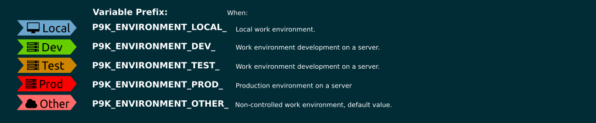

# Environment

    

## Installation

To use this segment, you need to activate it by adding `vagrant` to your
`P9K_LEFT_PROMPT_ELEMENTS` or `P9K_RIGHT_PROMPT_ELEMENTS` array, depending
where you want to show this segment.

## States

This segment can have different states. You can customize the different states
as you wish. Here is a quick overview:



## Configuration

The `environment` segment will print the environment from hostname.

This segment has four configurable work environments that are obtained by looking at the hostname and taking the value after the first point. In case of obtaining not contemplated a special environment is assigned

Each of the states is identified with a key. The key is compared to the environment obtained from the hostname and in this way the state is obtained. 
`P9K_<name-of-segment>_KEY_<state> == $ENVIRONMENT` 

| Variable | Default Value | Description |
|----------|---------------|-------------|
|P9K_ENVIRONMENT_KEY_LOCAL  |local  |key of the local environment|
|P9K_ENVIRONMENT_KEY_DEV    |dev    |key of the development environment|
|P9K_ENVIRONMENT_KEY_TEST   |test   |key of the testing environment|
|P9K_ENVIRONMENT_KEY_PROD   |prod   |key of the production environment|

Each of the states shows a text that is obtained from the variable `P9K_ <name-of-segment> _VALUE_ <state>` of each segment.

| Variable | Default Value | Description |
|----------|---------------|-------------|
|P9K_ENVIRONMENT_VALUE_LOCAL|Local|Value of the local environment|
|P9K_ENVIRONMENT_VALUE_DEV  |Dev|Value of the development environment|
|P9K_ENVIRONMENT_VALUE_TEST |Test|Value of the testing environment|
|P9K_ENVIRONMENT_VALUE_PROD |Prod|Value of the production environment|
|P9K_ENVIRONMENT_VALUE_OTHER|Other|Value of the other environment|

### Color Customization

You can change the foreground and background color of this segment by setting
```
# Environment local
P9K_ENVIRONMENT_LOCAL_FOREGROUND='black'
P9K_ENVIRONMENT_LOCAL_BACKGROUND='skyblue3'

# Environment dev
P9K_ENVIRONMENT_DEV_FOREGROUND='black'
P9K_ENVIRONMENT_DEV_BACKGROUND='chartreuse3'

# Environment test
P9K_ENVIRONMENT_TEST_FOREGROUND='black'
P9K_ENVIRONMENT_TEST_BACKGROUND='orange3'

# Environment prod
P9K_ENVIRONMENT_PROD_FOREGROUND='black'
P9K_ENVIRONMENT_PROD_BACKGROUND='red1'

# Environment other
P9K_ENVIRONMENT_OTHER_FOREGROUND='black'
P9K_ENVIRONMENT_OTHER_BACKGROUND='indianred1'
```

### Customize Icon

The main Icon of this segment depends on its state.
It can be changed by setting:
```
P9K_ENVIRONMENT_LOCAL_ICON="my_icon"
P9K_ENVIRONMENT_DEV_ICON="my_icon"
P9K_ENVIRONMENT_TEST_ICON="my_icon"
P9K_ENVIRONMENT_PROD_ICON="my_icon"
P9K_ENVIRONMENT_OTHER_ICON="my_icon"
```

The Icon color accordingly:
```
P9K_ENVIRONMENT_LOCAL_ICON_COLOR="red"
P9K_ENVIRONMENT_DEV_ICON_COLOR="red"
P9K_ENVIRONMENT_TEST_ICON_COLOR="red"
P9K_ENVIRONMENT_PROD_ICON_COLOR="red"
P9K_ENVIRONMENT_OTHER_ICON_COLOR="red"
```