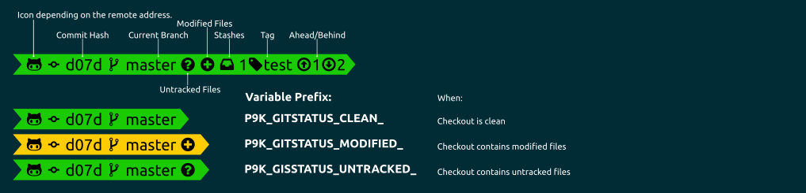

# Gitstatus


This segment is very similar to the [`vcs`](../vcs/README.md) segment. The major difference
is performance and the focus on `git`. It might not support all feature (like clobber
detection), but the most.

## Installation

To use this segment, you need to activate it by adding `gitstatus` to your
`P9K_LEFT_PROMPT_ELEMENTS` or `P9K_RIGHT_PROMPT_ELEMENTS` array, depending
where you want to show this segment.

Additionally, you need to install [gitstatus](https://github.com/romkatv/gitstatus) on your own, and point
`P9K_GITSTATUS_DIR` to the directory where `gitstatus.plugin.zsh` file lies.

## States

This segment can have different states. You can customize the different states
as you wish. Here is a quick overview:



## Configuration

The `gitstatus` segment will shows the status of your git repo. For customization,
you could set the following variables:

| Variable | Default Value | Description |
|----------|---------------|-------------|
|`P9K_GITSTATUS_MAX_SYNC_LATENCY_SECONDS`|`5`|Set to a higher value, if the gitstatus segment does not show up in your repo.|
|`P9K_GITSTATUS_HIDE_BRANCH_ICON`|`false`|Set to `true` to hide the branch icon from the segment.|
|`P9K_GITSTATUS_SHOW_CHANGESET`|`false`|Set to `true` to display the hash / changeset in the segment.|
|`P9K_GITSTATUS_CHANGESET_HASH_LENGTH`|`8`|How many characters of the hash / changeset to display in the segment.|
|`P9K_GITSTATUS_ACTIONFORMAT_FOREGROUND`|`red`|The color of the foreground font during actions (e.g., `REBASE`).|
|`P9K_GITSTATUS_ALWAYS_SHOW_REMOTE_BRANCH`|`false`|Set to true If you would to always see the remote branch.|

### Gitstatus symbols

The `gitstatus` segment uses various symbols to tell you the state of your repository.
These symbols depend on your installed font and selected `P9K_MODE`
from the [Installation](../../README.md#Installation) section.

| `Compatible` | `Powerline` | `Awesome Powerline` | Explanation
|--------------|---------------------|-------------------|--------------------------
| `↑4`         | `↑4`                | 4  | Number of commits your repository is ahead of your remote branch
| `↓5`         | `↓5`                | 5  | Number of commits your repository is behind of your remote branch
| `⍟3`         | `⍟3`                | 3 | Number of stashes, here 3.
| `●`          | `●`                 |  | There are unstaged changes in your working copy
| `✚`          | `✚`                 |  | There are staged changes in your working copy
| `?`          | `?`                 |   | There are files in your working copy, that are unknown to your repository
| `→`          | `→`                 |  | The name of your branch differs from its tracking branch.
| `@`         |  |  | Branch Icon
| None         |  None               | 2c3705 | The current commit hash. Here "2c3705"
| None         |  None               |  | Repository is a git repository

You can get a full list of icons used in your terminal by calling
`show_defined_icons`. It prints out a list of variables you can
set to overwrite every icon.

### Color Customization

You can change the foreground and background color of this segment by setting
```
# Checkout Clean
P9K_GITSTATUS_CLEAN_FOREGROUND='red'
P9K_GITSTATUS_CLEAN_BACKGROUND='blue'

# Checkout Contains Untracked Files
P9K_GITSTATUS_UNTRACKED_FOREGROUND='red'
P9K_GITSTATUS_UNTRACKED_BACKGROUND='blue'

# Checkout Contains (Tracked) Modified Files
P9K_GITSTATUS_MODIFIED_FOREGROUND='red'
P9K_GITSTATUS_MODIFIED_BACKGROUND='blue'
```

### Customize Icon

The main Icon of this segment depends on its state.
It can be changed by setting:
```
P9K_GITSTATUS_CLEAN_ICON="my_icon"
P9K_GITSTATUS_UNTRACKED_ICON="my_icon"
P9K_GITSTATUS_MODIFIED_ICON="my_icon"
```

The Icon color accordingly:
```
P9K_GITSTATUS_CLEAN_ICON_COLOR="red"
P9K_GITSTATUS_UNTRACKED_ICON_COLOR="red"
P9K_GITSTATUS_MODIFIED_ICON_COLOR="red"
```