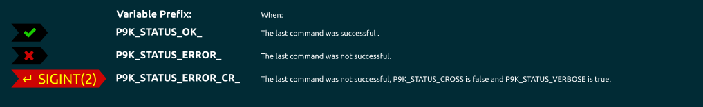

# Status


## Installation

To use this segment, you need to activate it by adding `status` to your
`P9K_LEFT_PROMPT_ELEMENTS` or `P9K_RIGHT_PROMPT_ELEMENTS` array, depending
where you want to show this segment.

## States

This segment can have different states. You can customize the different states
as you wish. Here is a quick overview:



## Configuration

This segment shows the return code of the last command.

| Variable | Default Value | Description |
|----------|---------------|-------------|
|`P9K_STATUS_CROSS`|`false`|Set to `true` if you wish not to show the error code when the last command returned an error.|
|`P9K_STATUS_OK`|`true`|Set to `true` if you wish to show this segment when the last command completed successfully, `false` to hide it.|
|`P9K_STATUS_SHOW_PIPESTATUS`|`true`|Set to `true` if you wish to show the exit status for all piped commands.|
|`P9K_STATUS_HIDE_SIGNAME`|`false`|Set to `true` to show the raw exit code (`1-255`).  When set to `false`, values over 128 are shown as `SIGNAME(n-128)` (e.g. `SIGINT(2)`)|

### Color Customization

You can change the foreground and background color of this segment by setting
```
# Status OK
P9K_STATUS_OK_FOREGROUND='red'
P9K_STATUS_OK_BACKGROUND='blue'

# Status Error (if P9K_STATUS_CROSS=true)
P9K_STATUS_ERROR_FOREGROUND='red'
P9K_STATUS_ERROR_BACKGROUND='blue'

# Status Error (if P9K_STATUS_CROSS=false)
P9K_STATUS_ERROR_CR_FOREGROUND='red'
P9K_STATUS_ERROR_CR_BACKGROUND='blue'
```

### Customize Icon

The main Icon of this segment depends on its state.
It can be changed by setting:
```
P9K_STATUS_OK_ICON="my_icon"
P9K_STATUS_ERROR_ICON="my_icon"
P9K_STATUS_ERROR_CR_ICON="my_icon"
```

The Icon color accordingly:
```
P9K_STATUS_OK_ICON_COLOR="red"
P9K_STATUS_ERROR_ICON_COLOR="red"
P9K_STATUS_ERROR_CR_ICON_COLOR="red"
```
