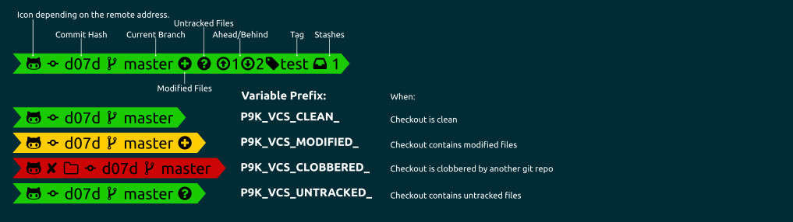

# VCS


## Installation

To use this segment, you need to activate it by adding `vcs` to your
`P9K_LEFT_PROMPT_ELEMENTS` or `P9K_RIGHT_PROMPT_ELEMENTS` array, depending
where you want to show this segment.

## States

This segment can have different states. You can customize the different states
as you wish. Here is a quick overview:



## Configuration

By default, the `vcs` segment will provide quite a bit of information. Further
customization is provided via:

| Variable | Default Value | Description |
|----------|---------------|-------------|
|`P9K_VCS_HIDE_BRANCH_ICON`|`false`|Set to `true` to hide the branch icon from the segment.|
|`P9K_VCS_SHOW_CHANGESET`|`false`|Set to `true` to display the hash / changeset in the segment.|
|`P9K_VCS_CHANGESET_HASH_LENGTH`|`12`|How many characters of the hash / changeset to display in the segment.|
|`P9K_VCS_SHOW_SUBMODULE_DIRTY`|`true`|Set to `false` to not reflect submodule status in the top-level repository prompt.|
|`P9K_VCS_HIDE_TAGS`|`false`|Set to `true` to stop tags being displayed in the segment.|
|`P9K_VCS_GIT_HOOKS`|`(vcs-detect-changes vcs-icon git-untracked git-aheadbehind git-stash git-remotebranch git-gitdir git-tagname)`|Layout of the segment for git repositories.|
|`P9K_VCS_HG_HOOKS`|`(vcs-detect-changes)`|Layout of the segment for Mercurial repositories.|
|`P9K_VCS_SVN_HOOKS`|`(vcs-detect-changes svn-detect-changes)`|Layout of the segment for SVN repositories.|
|`P9K_VCS_ACTIONFORMAT_FOREGROUND`|`red`|The color of the foreground font during actions (e.g., `REBASE`).|
|`P9K_VCS_GIT_ALWAYS_SHOW_REMOTE_BRANCH`|`false`|Set to true If you would to always see the remote branch.|

### vcs symbols

The `vcs` segment uses various symbols to tell you the state of your repository.
These symbols depend on your installed font and selected `P9K_MODE`
from the [Installation](../../README.md#Installation) section.

| `Compatible` | `Powerline` | `Awesome Powerline` | Explanation
|--------------|---------------------|-------------------|--------------------------
| `↑4`         | `↑4`                | 4  | Number of commits your repository is ahead of your remote branch
| `↓5`         | `↓5`                | 5  | Number of commits your repository is behind of your remote branch
| `⍟3`         | `⍟3`                | 3 | Number of stashes, here 3.
| `●`          | `●`                 |  | There are unstaged changes in your working copy
| `✚`          | `✚`                 |  | There are staged changes in your working copy
| `?`          | `?`                 |   | There are files in your working copy, that are unknown to your repository
| `→`          | `→`                 |  | The name of your branch differs from its tracking branch.
| `☿`          | `☿`                 |  | A mercurial bookmark is active.
| `@`         |  |  | Branch Icon
| None         |  None               | 2c3705 | The current commit hash. Here "2c3705"
| None         |  None               |  | Repository is a git repository
| None         |  None               |  | Repository is a Mercurial repository

You can get a full list of icons used in your terminal by calling
`show_defined_icons`. It prints out a list of variables you can
set to overwrite every icon.

### vcs truncation

You can limit the branch name to a certain length by truncating long names.
Customizations available are:

| Variable | Default Value | Description |
|----------|---------------|-------------|
|`P9K_VCS_SHORTEN_LENGTH`|None|This field determines how many characters to show.|
|`P9K_VCS_SHORTEN_MIN_LENGTH`|None|This field determines minimum branch length. Branch name will be truncated if its length greater than this field.|
|`P9K_VCS_DIR_SHORTEN_STRATEGY`|None|This field determines how branch name should be truncated. See the table below for more information.|
|`P9K_DIR_SHORTEN_DELIMITER`|`...`|Delimiter to use in truncated strings. This can be any string you choose, including an empty string if you wish to have no delimiter.|

| Strategy Name | Description |
|---------------|-------------|
|`truncate_middle`|Truncates the middle part of a branch. E.g. branch name is `1234-super_super_long_branch_name`, then it will truncated to `1234-..._name`, if `P9K_VCS_SHORTEN_LENGTH=5` is also set (controls the amount of characters to be left).|
|`truncate_from_right`|Just leaves the beginning of a branch name untouched. E.g. branch name will be truncated like so: `1234-...`. How many characters will be untouched is controlled by `P9K_VCS_SHORTEN_LENGTH`.|

For example, if you want to truncate `1234-super_super_long_branch_name` to `1234-..` and don't do it with `development`:
```zsh
P9K_VCS_SHORTEN_LENGTH=4
P9K_VCS_SHORTEN_MIN_LENGTH=11
P9K_VCS_DIR_SHORTEN_STRATEGY="truncate_from_right"
P9K_VCS_DIR_SHORTEN_DELIMITER=".."
```

### Advanced features

Sometimes you want to deactivate certain features like stashes. This can be
done by editing `P9K_VCS_GIT_HOOKS` and remove `git-stash` from that array.

Git hooks (`P9K_VCS_GIT_HOOKS`):

| Hook               | Description
|--------------------|----------------------------------------------------|
| vcs-detect-changes | General check for changed files and responsible for selecting a proper icon according to the remote url. |
| vcs-icon | Detects the icon base on the remote url. E.g. shows the Github icon for a repository cloned from Github. If no remote given, it uses the default icon from `P9K_VCS_GIT_ICON`. |
| git-untracked      | Check for untracked files. |
| git-aheadbehind    | Check for commits ahead/behind the repo. This does not request changes from the remote repo. Only interacts with the local repo. |
| git-stash          | Check for stashes. |
| git-remotebranch   | Checks the remote branch, and displays it, if it differs from local branch name. |
| git-gitdir         | Responsible to find out if we are in a clobbered checkout. |
| git-tagname        | Get the tagname, if we are on a tag. |

Mercurial hooks (`P9K_VCS_HG_HOOKS`):

| Hook               | Description
|--------------------|----------------------------------------------------|
| vcs-detect-changes | General check for changed files and responsible for selecting a proper icon according to the remote url. |
| vcs-icon | Detects the icon base on the remote url. E.g. shows the Github icon for a repository cloned from Github. If no remote given, it uses the default icon from `P9K_VCS_HG_ICON`. |
| hg-branch          | Escape special characters in branch name. |
| hg-bookmarks       | Check for Mercurial Bookmarks. |

SVN hooks (`P9K_VCS_SVN_HOOKS`):

| Hook               | Description
|--------------------|----------------------------------------------------|
| vcs-detect-changes | General check for changed files and responsible for selecting a proper icon according to the remote url. |
| svn-detect-changes | Check for staged/unstaged changes in your SVN checkout. |
| vcs-icon | Detects the icon base on the remote url. E.g. shows the Github icon for a repository cloned from Github. If no remote given, it uses the default icon from `P9K_VCS_SVN_ICON`. |

### Color Customization

You can change the foreground and background color of this segment by setting
```
# Checkout Clean
P9K_VCS_CLEAN_FOREGROUND='red'
P9K_VCS_CLEAN_BACKGROUND='blue'

# Checkout Contains Untracked Files
P9K_VCS_UNTRACKED_FOREGROUND='red'
P9K_VCS_UNTRACKED_BACKGROUND='blue'

# Checkout Contains (Tracked) Modified Files
P9K_VCS_MODIFIED_FOREGROUND='red'
P9K_VCS_MODIFIED_BACKGROUND='blue'

# Checkout Is Clobbered
P9K_VCS_CLOBBERED_FOREGROUND='red'
P9K_VCS_CLOBBERED_BACKGROUND='blue'
```

### Customize Icon

The main Icon of this segment depends on its state.
It can be changed by setting:
```
P9K_VCS_CLEAN_ICON="my_icon"
P9K_VCS_UNTRACKED_ICON="my_icon"
P9K_VCS_MODIFIED_ICON="my_icon"
P9K_VCS_CLOBBERED_ICON="my_icon"
```

The Icon color accordingly:
```
P9K_VCS_CLEAN_ICON_COLOR="red"
P9K_VCS_UNTRACKED_ICON_COLOR="red"
P9K_VCS_MODIFIED_ICON_COLOR="red"
P9K_VCS_CLOBBERED_ICON_COLOR="red"
```
